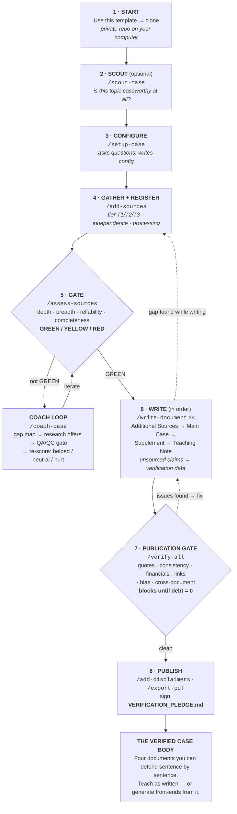

# Agentic AI Case Study Development Starter Kit

A starter kit for creating business school MBA case studies from digital sources, guided by AI.

[](TEMPLATE_VERSION)
[](LICENSE)

---

## What This Is

This repository is a **GitHub template** that gives you everything you need to develop a professional business school case study. You gather source materials (interviews, articles, financial reports), and AI guides you through the entire process — from assessing your sources to writing and verifying a four-document case study package.

### The Case Study Package

| Document | Audience | Purpose | Length |
|----------|----------|---------|--------|
| **Additional Sources** | Researchers | Raw materials, bibliography, exhibits | 1,500-2,500 words (6-10 pp.) |
| **Main Case** | Students | Protagonist-centered narrative with strategic tension | 2,000-3,000 words (8-12 pp.) |
| **Technical Supplement** | Students, Instructors | Industry context, frameworks, glossary | 1,200-2,000 words (5-8 pp.) |
| **Teaching Note** | Instructors only | Discussion guide, board plans, timing | 1,500-2,000 words (6-8 pp.) |

*Page counts assume roughly 250 words per page.* These targets are deliberately modest —
a complete package lands near 7,500 words rather than the 15,000 a full-length published
teaching case runs to. **A case that is too long does not get read, and does not get
revised**: the author is usually a student writing alongside a full-time job, and the
reviewer is usually a professor with a stack of them. If your situation genuinely calls
for more, `/setup-case` asks, and `documents.target_word_counts` in `case-config.yaml`
can be changed at any time.

**→ [See what this actually produces](examples/)** — excerpts from a real case package: the main case opening, an 80-minute session plan, the source registry, and the verification report that caught two defects before publication.

---

## The Map — clone to classroom



**Two gates carry the whole design.** `/assess-sources` stops you writing on thin sources; `/verify-all` stops you publishing unverified claims. Everything else is workflow.

**The loops are normal, not failure.** Coaching until the sources are strong enough, discovering a gap mid-draft and going back for a source, fixing what verification catches — all expected. Budget two to four research loops per document.

**Commit as you go** (`/git-update`). The development history becomes evidence of how the case was built.

**Using a chat tool instead?** The slash commands above belong to the agentic tools (Options A and B below), but the *shape* is the same. [`STARTER_PROMPT.md`](STARTER_PROMPT.md) walks you through this identical path conversationally — scouting, source integrity checks, the go/no-go gate, coaching through gaps, writing in order, quote verdicts, and a final checklist before you share. You'll paste and upload rather than let the tool read your folder, but you get the same discipline.

---

## Built for Verification — and for Your Judgment

AI writes fluently and fabricates confidently. Published studies have found leading
chatbots inventing anywhere from roughly a fifth to half of the citations they produce,
and Ivey Publishing judged a raw ChatGPT-drafted case unpublishable. The answer is not
"don't use AI." It is to **work the way a manager works with a capable new hire**:
delegate real work, expect competent output, and check it before it goes out — because
the result carries your name, not the assistant's.

**This kit gives you tools to check the work. It does not give you a guarantee, and it
cannot take responsibility off your shoulders.** What the verification workflow does is
*surface things for you to look at*: which claims trace to a source document and which
do not, where the source base leans in one direction, where two documents disagree,
where a quotation does not match the text it came from. What it cannot do is decide
whether a case is accurate, fair, or worth teaching. **That judgment is yours, it stays
yours, and no report this kit produces transfers it to a machine.**

Three mechanisms, and what each is honestly good for:

**Verification debt tracking.** When the AI writes something from its own knowledge
rather than from your sources, it is instructed to log that claim to
`verification-debt.yaml` with the kind of source needed to settle it. This is genuinely
useful — but it records what the AI *notices about itself*, so treat it as a working
list to reduce, not a complete inventory of everything unsourced. Publication expects
the debt at zero **or explicitly acknowledged**.

**Source tiering and a go/no-go gate.** Every source is classified T1 (full text in the
repo), T2 (partial or excerpted), or T3 (referenced only). Before writing begins,
`/assess-sources` checks a minimum: a primary source carrying the protagonist's own
voice, a primary financial source, independent coverage from more than one publication,
and an independence ratio that flags a base leaning heavily on the subject's own
material. The gate is a floor, not a verdict on quality — clearing it means you have
enough to start, not that your sourcing is good.

**Seven verification checks before publication.** `/verify-all` attempts to trace quotes
to dated sources, match figures across documents, recompute arithmetic, test links,
weigh perspective balance, and check structural alignment, producing a report you can
read and act on. **These checks find real problems and they also miss things.** In this
project's own field testing, a run of `/verify-all` reported quotes as passing on a
package that a later line-by-line trace showed carried five genuine quote defects — two
misquotes, dropped words, framing pulled inside quotation marks, and an illustration the
author had invented sitting in quotes. The checks have been strengthened since, and they
still are not a substitute for you reading your own case against your own sources. The
full record, including the failures, is in `evals/test-log.md`.

### Your job, and the AI's

Think of yourself as the manager and the AI as a fast, well-read assistant who is
occasionally, confidently wrong.

| The AI is good at | Only you can |
|---|---|
| Reading a large corpus quickly and pulling out candidate material | Decide what the case is actually *about* |
| Drafting structure and prose at speed | Judge whether the tension is real and teachable |
| Mechanical checks — does this string appear in that file, does this arithmetic hold | Judge whether a source is credible and a framing is fair |
| Flagging what it could not verify | Decide what to do about it, and whether to ship |

**You are accountable for what you publish**, including the parts you did not write. If a
number is wrong, "the AI generated it" is not a defense a colleague, a department chair,
or a student will accept — nor should it be. Read the case. Check the quotes that matter
against the sources yourself. Disagree with the tool when your experience says it is
wrong; it is a tool, and you know things it does not.

### Why this is a teaching tool

The point of building a case this way is not only to end up with a case. It is to give
you and your students direct experience of **what current AI is genuinely good at and
where it fails** — which is difficult to teach in the abstract and obvious after you
have watched a model produce a fluent paragraph resting on a quotation that does not
exist.

Used well, the workflow surfaces that contrast repeatedly: the draft that reads
beautifully and cites a source that says something else; the source base that looks
abundant and turns out to be the subject talking about themselves; the check that
returns green because it never actually looked.

**Two of these are worth knowing in advance, because they are the ones that surprise
people.** First, **fixing problems creates problems** — in this project's own testing,
correcting 25 verification findings introduced 11 new ones, and the same pattern shows up
every time anyone measures it. Budget a re-check after every correction round; treat a
repair like any other edit, because it is one. Second, **"I fixed everything" is
frequently wrong, said in complete good faith** — in the same test an AI reported fifteen
corrections complete when eight were still sitting in the documents. It was not being
evasive; it had genuinely lost track. Neither of those is a reason to distrust the tool.
They are reasons to check its work, which is your job anyway.

**Notice those moments and write them down** — the reflection is a large part of the learning, arguably larger than the
finished document. `lessons_learned.md` exists for exactly that, and this project's own
entries are a record of the maintainers getting these things wrong and catching them
later.

---

## Quick Start

### Step 1: Create Your Repository

Click the green **"Use this template"** button above, then **"Create a new repository"**. Name it something like `CompanyXYZ-case-study` (you can rename this later). Set it to **Private**.

### Step 2: Get the Files onto Your Computer

Open a terminal and clone your new repository.

**Mac** — open Terminal (search "Terminal" in Spotlight):

```bash
cd ~/Desktop
git clone https://github.com/YOUR-USERNAME/YOUR-REPO-NAME.git
cd YOUR-REPO-NAME
```

**Windows** — open PowerShell (search "PowerShell" in Start menu):

```powershell
cd ~\Desktop
git clone https://github.com/YOUR-USERNAME/YOUR-REPO-NAME.git
cd YOUR-REPO-NAME
```

Replace `YOUR-USERNAME` and `YOUR-REPO-NAME` with your actual values. Use any folder you prefer — Desktop is just an example.

> **Tip**: On Mac, you can drag your project folder onto the Terminal icon to open it there. On Windows, right-click a folder in File Explorer and select "Open in Terminal."

<details>
<summary><strong>Alternative: Download ZIP (no git required)</strong></summary>

1. Go to your new repository on GitHub
2. Click the green **"Code"** button → **"Download ZIP"**
3. Unzip to any folder on your computer

Note: The ZIP option won't have git features (version history, pushing changes). You can still do all the case study work.
</details>

### Step 3: Choose Your AI Tool

**If you are not sure, use Claude Cowork.** It is the shortest path from a cloned
folder to a finished case, and it does not require a terminal, an editor, or any
developer setup. The rest of this section is optional reading — skip to Step 4 unless
you specifically want a different tool.

#### Recommended: Claude Cowork

Cowork works on your project folder directly — it reads your sources, writes the case
documents, and keeps the tracking files current, the same as the developer tools below.
What it does not require is that you be comfortable with a command line.

**Two places still touch the command line, and you can avoid both.** Getting the files
onto your computer (Step 2) is written with `git clone` — instead, use GitHub's
**"Download ZIP"** button and unzip it wherever you keep your work. And `/export-pdf`
prepares your markdown but hands the actual conversion to a tool like Pandoc; you can
skip that and open the finished `.md` files in Word, Google Docs, or any markdown editor
to produce a PDF. Saving your work with `/git-update` is also git-based — if you are not
using git, keep the folder in a synced drive and skip that step. **Nothing in the
authoring, sourcing, or verification workflow needs a terminal**; those three
conveniences do.

1. Open Cowork and point it at the folder you created in Step 2.
2. Say: **"Read AGENTS.md and help me develop my case study."**
3. Follow what it asks. It will configure the project, help you gather and assess
   sources, and write the documents in order.

That is the whole setup. Everything the kit knows how to do lives in `AGENTS.md` and
the skill files in `.claude/skills/`, and Cowork reads both.

**One thing to know.** The `/slash-commands` listed later in this README are Claude
Code's command format. If Cowork does not offer them, nothing is lost — ask in plain
language instead ("assess my sources", "write the main case"), and the agent will read
the matching skill file and follow the same procedure. `AGENTS.md` instructs it to.
Every capability is reachable either way; only the shortcut differs.

> **Status: newly added and not yet field-tested.** The Cowork path is documented here
> because it is the best fit for non-technical authors, but it has not yet been run
> end-to-end on a real case the way the Claude Code path has. If something in it does
> not match what you see, please open an issue — that feedback is actively wanted.

#### Alternate paths, if you prefer one

You do not need these. They exist because some authors already work in these tools.

| | Cowork | Claude Code | VS Code + Copilot | Chat Tools |
|---|---|---|---|---|
| Reads local files | Yes | Yes | Yes (Agent Mode) | No |
| Writes/edits files | Yes | Yes | Yes (Agent Mode) | No |
| Runs terminal commands | No | Yes | Yes | No |
| `/slash-commands` | Ask in plain language | Yes (20 skills) | No (use natural language) | No |
| Custom instructions | AGENTS.md | CLAUDE.md | .github/copilot-instructions.md | STARTER_PROMPT.md |
| Setup required | None (download the ZIP) | Install + subscription | Install VS Code | None |
| Best for | **Most authors** | Full automation, developers | Students already in VS Code | Any assistant, most manual |

#### Option A: Claude Code

Claude Code can read your files, run `/slash-commands`, and manage the entire workflow automatically.

1. Open your project in Claude Code
2. Say: **"Help me develop my case study"**
3. Or run: `/setup-case` to get started

#### Option B: VS Code + GitHub Copilot (Free for Students)

VS Code with **Copilot Agent Mode** can read and edit your local files, run terminal commands, and follow the custom instructions in this repo — making it a full agentic workflow.

1. Sign up for **GitHub Education** at [education.github.com](https://education.github.com) to get **Copilot Pro free** (unlimited completions, 300 premium requests/month)
2. Install [VS Code](https://code.visualstudio.com/) and the **GitHub Copilot** extension
3. Open your project folder in VS Code
4. Open the Copilot chat panel (click the Copilot icon in the sidebar) and select **Agent Mode**
5. Say: **"Help me develop my case study"**

Copilot reads `.github/copilot-instructions.md` automatically. Instead of `/slash-commands`, describe what you want in natural language (e.g., *"Evaluate my source quality"* instead of `/assess-sources`).

#### Option C: Chat Tools (ChatGPT, Claude.ai, Gemini)

Chat tools work but cannot read files on your computer directly. You must upload or paste content into the chat.

1. Open **[STARTER_PROMPT.md](STARTER_PROMPT.md)** and copy the prompt inside
2. Paste it into your chat tool
3. When the AI asks about your sources, **drag-and-drop** your source files into the chat or paste the text

> **Important**: Chat tools cannot run the `/slash-commands` or read your local files. The starter prompt is designed to guide you through the process conversationally instead.

#### Using Perplexity (common at universities with campus licenses)

Perplexity pairs well with this kit. Use it for the research half, and an agentic tool for the authoring half.

**Where it shines:**

- **Scouting a topic.** Before committing to a company, find out whether it has a protagonist who speaks publicly, an identifiable decision, and accessible financials — the questions `/scout-case` asks.
- **Finding and vetting sources.** Hunting interviews, filings, independent coverage, and background on named people — the legwork `/coach-case` sends you to do.
- **Keeping a source base current.** Perplexity **Computer** runs recurring background tasks, so it can watch a company for new filings and coverage between semesters. Useful for a case you will teach more than once.
- **Working your corpus.** Load sources into a **Project** (Enterprise Pro allows 500 files, 50 MB each), add custom instructions, and share it with students as a front-end for the finished case.

**The handoff.** Perplexity works in its own environment rather than in your case repository, so once you have sources, bring them into this repo and switch to Option A or B for writing and verification. Comet automates browsers; Computer runs tasks in a cloud workspace; the Mac-only Personal Computer can reach a local folder but has no documented git or shell support. Plan availability varies — check what your campus license covers.

One habit worth keeping: Perplexity's citations make sources easy to find, which is not the same as confirming the source supports the claim. Bring the source into `sources/` and let `/verify-quotes` close that loop.

#### Getting Tech Help

Running into issues with git, the terminal, or project setup? **Any AI tool can help you troubleshoot** — you don't need to use the same tool you're writing the case study with.

- **Paste the error message** into any AI chat (ChatGPT, Claude.ai, Gemini, Copilot) and ask for help
- **Describe what you were trying to do** and what happened instead
- Common issues: git authentication, cloning, file paths, OneDrive conflicts (see [Troubleshooting](#troubleshooting) below)

### Step 4: Configure Your Case

**Claude Code users**: Run `/setup-case` — it asks you questions and writes the config files automatically.

**VS Code + Copilot users**: Say *"Help me configure my case study"* in Copilot Agent Mode.

**Chat tool users**: The starter prompt will ask you about your company, protagonist, and topic.

**Manual setup**: Open `case-config.yaml` and replace the placeholder values.

> **Tidying up (optional).** The template also ships the tooling used to maintain the kit itself. If you are writing a case rather than developing the template, you can delete `scripts/`, `evals/`, `docs/`, `RELEASING.md`, `.gitignore-private`, and the `release-kit` and `run-eval` skills from `.claude/skills/`. Nothing in the case workflow depends on them.

### Step 5: Gather Sources and Write

Add research materials to `sources/` (transcripts, articles, financial reports). Then follow the AI-guided process to write your four documents.

**Save your progress** after each major step:

**Mac:**
```bash
git add -A && git commit -m "Complete Additional Sources draft" && git push
```

**Windows:**
```powershell
git add -A; git commit -m "Complete Additional Sources draft"; git push
```

Or in Claude Code, run `/git-update`.

---

## Workflow Overview

The process is **iterative**, not strictly linear. You'll cycle between sources and writing as gaps are discovered.

```
SETUP → SOURCES → ASSESS → WRITE → [gap found?] → back to SOURCES
                                  → [no gap] → VERIFY → PUBLISH
```

| Phase | What to Do | Skill Command |
|-------|-----------|---------------|
| 1. Configure | Set up case details | `/setup-case` |
| 2. Add Sources | Register source materials | `/add-sources` |
| 3. Assess | Evaluate source quality | `/assess-sources` |
| 4. Write | Create documents in order | `/write-document` |
| 5. Verify | Run quality checks | `/verify-all` |
| 6. Publish | Add disclaimers, export PDFs | `/add-disclaimers`, `/export-pdf` |

Check your progress anytime: `/check-status`

---

## What's in This Repository

| Path | Purpose |
|------|---------|
| `AGENTS.md` | Canonical instructions for AI agents (all tools) |
| `VERIFICATION_PLEDGE.md` | Author sign-off checklist for sharing a finished case |
| `STARTER_PROMPT.md` | Prompt for chat tools (ChatGPT, Claude.ai, Gemini) |
| `case-config.yaml` | Central configuration (auto-written by `/setup-case`) |
| `learning-context.yaml` | Classroom context for tailoring generated teaching materials |
| `RELEASING.md` | Two-remote workflow for maintainers |
| `verification-debt.yaml` | Tracks unverified AI-generated claims |
| `sources/` | Your research materials |
| `sources/Source_Registry.md` | Source catalog with quality tiers |
| `case-study/` | Where your four case documents will live |
| `exports/` | PDF exports for distribution |
| `templates/` | Detailed prompts, QA workflows, source guides |
| `.claude/skills/` | Claude Code skill definitions |
| `.github/copilot-instructions.md` | VS Code Copilot custom instructions |
| `PROJECT_CONTEXT.md` | Session continuity context |
| `examples/` | Excerpts from a real generated case package — start here |
| `evals/` | Regression-testing framework for kit versions (see `evals/EVALS.md`) |
| `log.md`, `lessons_learned.md` | Development log and per-version lessons |
| `docs/` | Workflow map as a standalone image for slides and handouts |
| `scripts/` | Maintainer tooling: version bump, lint, release preflight, release notes |
| `RELEASING.md` | Two-remote release workflow (maintainers) |

---

## Skills Reference

These `/slash-commands` work in **Claude Code**. **VS Code + Copilot** users: ask for the same action in natural language (e.g., say *"Run all quality checks"* instead of `/verify-all`). See `.github/copilot-instructions.md` for the full equivalents table.

| Command | Purpose |
|---------|---------|
| `/scout-case` | Scout candidate topics before committing — caseworthiness verdict |
| `/setup-case` | Configure project (asks questions, writes files) |
| `/add-sources` | Register source materials with tier classification |
| `/assess-sources` | Evaluate source quality with go/no-go gate |
| `/coach-case` | Coaching loop: diagnose gaps, offer research help, QA/QC new sources, log iterations |
| `/write-document` | Guided document writing with inline verification |
| `/check-status` | Project dashboard with progress and debt tracking |
| `/verify-all` | Run all quality checks |
| `/verify-consistency` | Cross-document data point matching |
| `/verify-quotes` | Trace quotes back to source documents |
| `/verify-sources` | Check attribution completeness |
| `/verify-links` | Validate external URLs |
| `/validate-financials` | Check arithmetic and financial accuracy |
| `/assess-bias` | Analyze source perspective balance |
| `/verify-cross-document` | Structural alignment between documents |
| `/add-disclaimers` | Add AI methodology disclaimers |
| `/export-pdf` | Prepare documents for PDF export |
| `/git-update` | Stage, commit, and push changes |

**Maintainer skills** (for developing the template itself, not for writing a case): `/release-kit` cuts a new kit version; `/run-eval` regression-tests the kit against a frozen fixture. See `RELEASING.md`.

---

## For Non-Business Cases

Writing about public policy, political leadership, or international development? See `templates/HKS_PUBLIC_POLICY_GUIDANCE.md` for adapted frameworks. Run `/setup-case` and select "public policy" when asked about case type.

---

## Troubleshooting

### "The AI can't see my files"

Chat tools (ChatGPT, Claude.ai, Gemini) **cannot** read files on your computer. You must:
- Drag-and-drop files into the chat window, OR
- Copy-paste the file contents

Claude Code and VS Code + Copilot (Agent Mode) can read your local files directly — no uploading needed.

### GitHub credentials / authentication issues

If `git push` asks for credentials:
1. Install [GitHub CLI](https://cli.github.com/): `gh auth login`
2. Or use a [personal access token](https://docs.github.com/en/authentication/keeping-your-account-and-data-secure/managing-your-personal-access-tokens)

### OneDrive / iCloud path issues

If your project is in a synced folder (OneDrive, iCloud, Dropbox), git may behave unexpectedly. Move your project to a non-synced location:

**Mac:**
```bash
mv ~/Desktop/my-case-study ~/Documents/my-case-study
```

**Windows:**
```powershell
Move-Item ~\Desktop\my-case-study ~\Documents\my-case-study
```

### "I don't know which step to do next"

In Claude Code, run `/check-status` for a full project dashboard.

### "I made a mistake and want to undo"

If you committed recently, git has your history:
```bash
git log --oneline -5
```
Ask Claude Code for help reverting to a previous state.

---

## License

The kit itself — skills, templates, workflows, documentation — is **MIT-licensed**: use it, adapt it, build on it at any institution, commercial or not. **Case studies you create with the kit are your own work**, under whatever license you choose; the setup process suggests CC BY-NC 4.0 as a sensible default for educational case materials.

---

## Acknowledgments

This methodology was developed through the creation of MBA case studies for ITEC-617 at American University's Kogod School of Business, Spring 2026, supported by a Kogod AI mini-grant (Carmel & Ulstrup).

---

*Template Version: 4.3.0*
